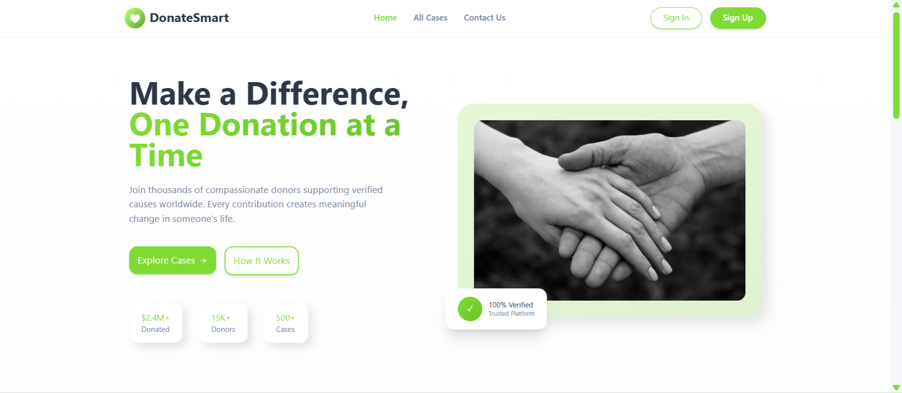

_This is the graduation project of ASAC Advanced Javascipt Training._
[original repo](https://github.com/Donate-Smart)

# [Donate Smart <small>🔗 </small>](https://donate-smart.netlify.app)

### Description

DonateSmart is an AI-powered donation platform that connects donors with verified humanitarian cases. Using Gemini AI, the system analyzes each case description, automatically generates a short summary, and classifies it by type (medical, educational, emergency, social, etc.).

#### Scope:

- Users can register and log in.
- Donors can browse cases, read AI-generated summaries, and simulate donations.
- Registered users can submit new cases for approval.
- Admins can approve, edit, or delete cases.
- Gemini API handles text summarization.



### Running

```shell
cd ./frontend
npm start

cd ./backend
npm start
```
